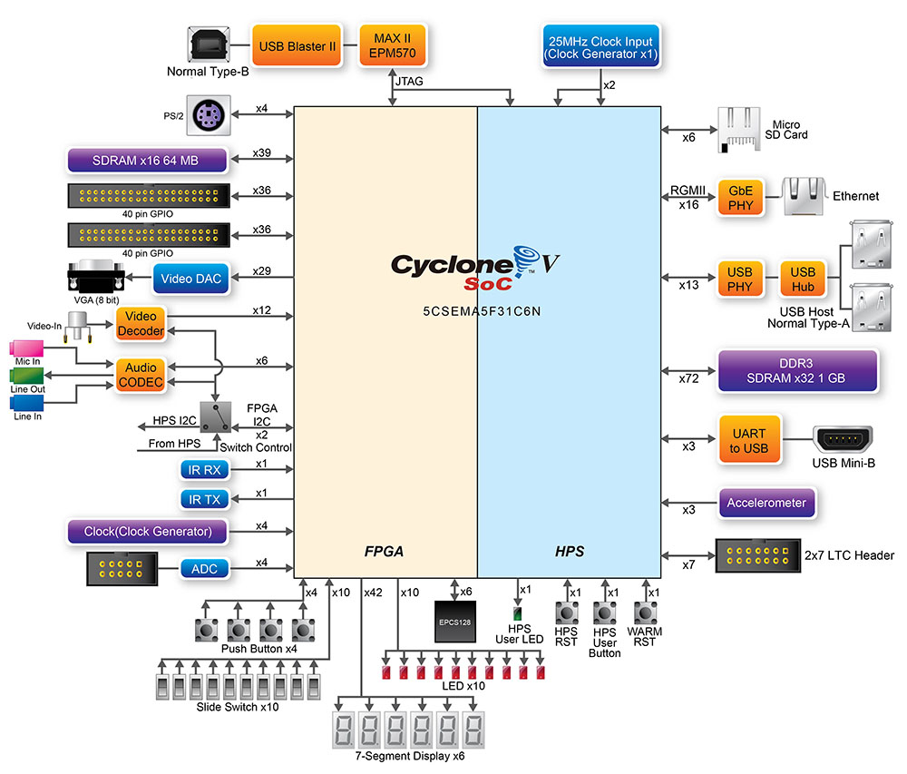

# Marco 2 — Integração HPS↔Linux via Driver (Assembly ARM)

> **TEC 499 — MI Sistemas Digitais 2026.1 | UEFS**

## Sumário

01. [Visão Geral do Projeto](#1-visão-geral-do-projeto)
02. [Levantamento de Requisitos](#2-levantamento-de-requisitos)
03. [Fundamentação Teórica](#3-fundamentação-teórica)
04. [Arquitetura do Sistema](#4-arquitetura-do-sistema)
05. [Especificação de Hardware e Software](#5-especificação-de-hardware-e-software)
06. [Processo de Desenvolvimento](#6-processo-de-desenvolvimento)
07. [Instalação e Configuração](#7-instalação-e-configuração)
08. [Testes de Funcionamento](#8-testes-de-funcionamento)
09. [Análise dos Resultados](#9-análise-dos-resultados)
10. [Equipe de Desenvolvimento](#10-equipe-de-desenvolvimento)
11. [Referências](#11-referências)


## 1. Visão Geral do Projeto

Este marco representa a integração entre o co-processador ELM implementado em FPGA no Marco 1 e o processador ARM (HPS) da plataforma DE1-SoC. O objetivo é estabelecer uma interface funcional e estável entre o sistema operacional Linux, executado no HPS, e o núcleo acelerador na FPGA, utilizando I/O mapeado em memória (MMIO) por meio da Lightweight HPS-to-FPGA Bridge.

O resultado é um driver em Assembly ARM que expõe uma API de alto nível para a aplicação em C: inicialização do mapeamento de memória, carregamento dos parâmetros da rede neural (pesos, bias, beta), envio da imagem de entrada, disparo e monitoramento da inferência, além de leitura do resultado e das métricas de desempenho.


## 2. Levantamento de Requisitos

- Integrar o IP elm_accel ao HPS da DE1-SoC via Lightweight HPS-to-FPGA Bridge.
- Implementar um driver em Assembly ARM (userspace via _/dev/mem_) que permita à aplicação:
  - Inicializar o hardware
  - Enviar os pesos
  - Enviar o bias
  - Enviar os pesos de saída
  - Iniciar a inferência
  - Aguardar finalização (_polling_ ou interrupção)
  - Ler o resultado da predição
  - Ler o contador de ciclos e outras métricas
- As rotinas críticas de acesso ao hardware devem ser integralmente implementadas em Assembly ARM.
- O driver deve expor uma API estável definida, linkada com a aplicação em C.
- Classificar uma imagem conhecida repetidamente sem falhas.


## 3. Fundamentação Teórica

Esta seção apresenta os conceitos que sustentam a integração entre o Linux e o co-processador em FPGA, incluindo a interface HPS↔FPGA, o modelo MMIO, a programação em Assembly ARMv7 e o protocolo de handshake de hardware.

## 

### 3.1 Arquitetura da DE1-SoC: Sistema Heterogêneo HPS + FPGA

A plataforma DE1-SoC integra em um único chip dois domínios de processamento:

- **HPS (Hard Processor System):** Processador ARM Cortex-A9 dual-core executando Linux embarcado.
- **FPGA (Field Programmable Gate Array):** Matriz de portas programáveis onde o co-processador elm_accel foi implementado.

A comunicação entre eles é feita por bridges AXI. O projeto utiliza a **Lightweight HPS-to-FPGA Bridge (LWHPS2FPGA)**, mapeada no espaço de endereçamento físico do HPS a partir do endereço **0xFF200000**, com janela de 4 KB. Essa bridge é adequada para acesso a registradores de controle de baixo volume, como os utilizados pela ISA do co-processador.


**Figura 1 – Diagrama da arquitetura HPS-FPGA da DE1-SoC**

##

### 3.2 I/O Mapeado em Memória (MMIO) e /dev/mem

No modelo MMIO, endereços de memória são atribuídos a registradores de periféricos. O processador ARM interage com o hardware por meio das instruções LDR/STR, sem necessidade de instruções especiais de I/O.

Em ambiente Linux, o acesso a endereços físicos de hardware é feito via _/dev/mem_:

1. O driver abre _/dev/mem_ com a flag combinada 0x101002 (O_RDWR | O_SYNC). O O_SYNC desabilita o cache L1/L2 do ARM e força as escritas diretas ao barramento, sem essa flag, dados podem ficar retidos no cache e jamais chegar à FPGA.
2. Chama mmap2 (syscall 192 no ARMv7) para associar o intervalo de endereços físicos da bridge a um ponteiro virtual no processo. O offset passado ao mmap2 deve ser o endereço físico deslocado 12 bits para a direita (LW_BRIDGE_BASE = 0xFF200), conforme a API da syscall.
3. As funções do driver recebem esse ponteiro como parâmetro (lw_virtual) e realizam acessos com STR/LDR nos offsets dos registradores.
4. Ao encerrar, munmap (syscall 91) libera o mapeamento.

##

### 3.3 Arquitetura ARM Cortex-A9 e Programação em Assembly ARMv7

O processador ARM Cortex-A9 implementa a arquitetura ARMv7-A. Os aspectos relevantes para o driver são:

- 16 registradores de propósito geral (R0–R15). R13 (SP), R14 (LR) e R15 (PC) têm funções especiais.
- Por convenção, os parâmetros são passados em R0–R3, valor de retorno em R0, registradores R4–R11 são callee-saved (o chamado deve preservá-los com PUSH/POP).
- O número da syscall é colocado em R7 e a chamada é disparada com SVC #0.
- Os parâmetros seguem a convenção AAPCS.

As syscalls utilizadas no driver são:

| Syscall     | Número | Uso no driver                          |
|-------------|--------|----------------------------------------|
| SYS_READ  | 3      | Ler arquivos de imagem e parâmetros    |
| SYS_OPEN  | 5      | Abrir _/dev/mem_ e arquivos de dados   |
| SYS_CLOSE | 6      | Fechar file descriptors                |
| SYS_MUNMAP| 91     | Desfazer o mapeamento da bridge        |
| SYS_MMAP2 | 192    | Mapear a bridge no espaço virtual      |

##

### 3.4 Mapa de Registradores

O co-processador expõe os seguintes registradores, acessíveis como offsets do ponteiro lw_virtual:

| Offset   | Constante      | Tipo | Descrição                                                           |
|----------|----------------|------|---------------------------------------------------------------------|
| 0x20   | INST_BASE    | W    | Registrador de instrução: recebe a palavra de 32 bits codificada    |
| 0x30   | OUT_BASE     | R    | Registrador de saída: resultado da instrução executada              |
| 0x40   | ENABLE_BASE  | W    | Sinal de handshake: pulso que dispara a execução                    |
| 0x50   | BUSY_BASE    | R    | Indica que o co-processador está ocupado                            |
| 0x60   | RESET_BASE   | W    | Reset síncrono (escreve 1 para resetar, 0 para liberar)             |
| 0x70   | DONE_BASE    | R    | Sinal de conclusão da instrução atual (usado no polling)            |

##

### 3.5 Codificação de Instruções

#### 3.5.1 Codificação da instrução de 32 bits:

```
 31     28 27      16 15           0
 ┌────────┬──────────┬──────────────┐
 │ opcode │   addr   │     data     │
 │  [4b]  │  [12b]   │    [16b]     │
 └────────┴──────────┴──────────────┘
```

Para OP_PES_ADDR, os bits [16:0] carregam integralmente o endereço de 17 bits do peso.

#### 3.5.2 Tabela de opcodes (bits [31:28]):

| Opcode | Constante     | Descrição                                                                            |
|--------|---------------|--------------------------------------------------------------------------------------|
| 0    | OP_IMG      | Armazena pixel: addr=posição [0–783], data=valor 8-bit do pixel                 |
| 1    | OP_PES_ADDR | 1ª fase do peso: [16:0] = endereço de 17 bits (0–100351)                          |
| 2    | OP_PES_DATA | 2ª fase do peso: data[15:0] = valor Q4.12                                         |
| 3    | OP_BIAS     | Armazena bias: addr=posição [0–127], data=valor Q4.12                           |
| 4    | OP_BETA     | Armazena peso de saída β: addr=posição [0–1279], data=valor Q4.12               |
| 5    | OP_START    | Inicia a inferência. Resultado fica em OUT_BASE após DONE                         |
| 6    | OP_STATUS   | Consulta estado da FSM. OUT_BASE retorna estado + predição                        |
| 7    | OP_ACTV     | Define função de ativação: data[1:0] = 00/11→Tanh, 01→Sigmoid, 10→ReLU           |
| 8    | OP_CYCLES   | Lê contador de ciclos da última inferência em OUT_BASE                             | 


#### 3.5.3 Decodificação do registrador OUT_BASE após OP_STATUS:

```
 Bit 11–10 │ Bit 9    │ Bit 8  │ Bit 7  │ Bits 3–0
 ──────────┼──────────┼────────┼────────┼──────────
  ativacao │ wait_w   │  done  │  busy  │   pred
  [2 bits] │ [1 bit]  │[1 bit] │[1 bit] │ [4 bits]
```

| Campo      | Bits     | Descrição                                              |
|------------|----------|--------------------------------------------------------|
| ativacao | [11:10]  | Função de ativação ativa: 00=Tanh, 01=Sigmoid, 10=ReLU |
| wait_w   | [9]      | FSM aguardando OP_PES_DATA (após OP_PES_ADDR)      |
| done     | [8]      | Última instrução concluída                             |
| busy     | [7]      | Co-processador em execução                             |
| pred     | [3:0]    | Resultado da última inferência (dígito 0–9)            |

##

### 3.5 Protocolo de Handshake (ENABLE/DONE)

Toda comunicação com o co-processador segue um protocolo de handshake de quatro fases, implementado na rotina loop_enable:

```
1. Driver escreve instrução em INST_BASE
2. Driver sobe ENABLE_BASE → 1      (FPGA detecta a borda de subida: enable_pulse)
3. Driver faz polling: aguarda DONE_BASE == 1   (FPGA concluiu)
4. Driver desce ENABLE_BASE → 0
5. Driver faz polling: aguarda DONE_BASE == 0   (FPGA limpou o estado)
```

Na etapa 5, sem aguardar DONE=0, a próxima instrução pode ser interpretada como já concluída pelo hardware antes mesmo de ser executada, corrompendo o fluxo.

A instrução OP_PES_ADDR é uma exceção: por ser a primeira fase de uma operação de dois ciclos, a FPGA não gera DONE=1 isoladamente para ela (fica em ST_WAIT_PES aguardando OP_PES_DATA). Por isso, send_weight_addr utiliza um delay fixo de 100 iterações em vez do handshake completo.


## 4. Arquitetura do Sistema

### 4.1 Visão Geral

```
┌────────────────────────────────────────┐
│         main.c — Menu interativo       │  C (usuário)
├──────────────┬─────────────────────────┤
│  converter.h │   buffers.h / hps_0.h   │  Suporte em C
├──────────────┴─────────────────────────┤
│           api.S — Driver ARM           │  Assembly ARMv7
├────────────────────┬───────────────────┤
│   Linux Kernel     │  /dev/mem (mmap2) │
├────────────────────┴───────────────────┤
│   LW HPS-to-FPGA Bridge  0xFF200000    │  Hardware
├────────────────────────────────────────┤
│    Co-processador elm_accel (FPGA)     │  elm_accel.v
└────────────────────────────────────────┘
```

O sistema é composto por três camadas de software:

- **api.S** — Driver em Assembly ARM, que realiza todas as operações de baixo nível: mapeamento de memória via _/dev/mem_, codificação das instruções de 32 bits e protocolo de handshake com o hardware.
- **api.h / hps_0.h** — Cabeçalhos que definem a API pública do driver e as constantes de hardware (endereços, opcodes, tamanhos).
- **main.c** — Aplicação interativa em C com menu de terminal, que permite ao usuário carregar parâmetros, enviar imagens e disparar inferências no co-processador.

##

### 4.2 Co-processador elm_accel.v

A interface do co-processador com o HPS é:

| Sinal       | Direção | Largura | Descrição                                   |
|-------------|---------|---------|---------------------------------------------|
| clk         | Input   | 1       | Clock do sistema (50 MHz)                   |
| rst         | Input   | 1       | Reset síncrono ativo alto                   |
| instruction | Input   | 32      | Palavra de instrução codificada             |
| enable      | Input   | 1       | Sinal de handshake                          |
| result      | Output  | 32      | Resultado da instrução executada            |
| busy        | Output  | 1       | Co-processador em execução                  |
| done        | Output  | 1       | Instrução atual concluída                   |
| error       | Output  | 1       | Erro durante execução                       |

A FSM do elm_accel possui oito estados: ST_IDLE, ST_FETCH, ST_DECODE, ST_EXECUTE, ST_DONE, ST_WAIT_W, ST_WAIT_PES e ST_INFER.
- O campo opcode é decodificado de instruction[31:28]
- O campo endereço de instruction[27:16] (ou [16:0] para pesos)
- O dado a ser enviado de instruction[15:0].

##

### 4.3 Driver em Assembly ARM (api.S)

O driver é implementado em api.S, com buffers estáticos declarados na seção .bss:

| Buffer         | Tamanho       | Conteúdo                          |
|----------------|---------------|-----------------------------------|
| image_buffer   | 784 bytes     | Pixels da imagem (uint8)          |
| bias_buffer    | 256 bytes     | 128 valores de bias (uint16 Q4.12)|
| beta_buffer    | 2.560 bytes   | 1.280 pesos β (uint16 Q4.12)      |
| pesos_buffer   | 200.704 bytes | 100.352 pesos W_in (uint16 Q4.12) |

#### Rotinas públicas

| Função            | Protótipo C                               | Descrição                                                                    |
|-------------------|-------------------------------------------|------------------------------------------------------------------------------|
| hps_open          | void* hps_open(void)                      | Abre a ponte de comunicação com a FPGA e devolve um ponteiro para acessá-la. Retorna -1 se falhar. |
| hps_close         | void hps_close(void* lw_virtual)        | Fecha a ponte e libera os recursos de memória usados.                         |
| reset_cop         | void reset_cop(void* lw_virtual)        | Reinicia o co-processador, limpando qualquer estado anterior.                   |
| get_result        | int32_t get_result(void* lw_virtual)    | Lê e retorna o último valor presente no registrador de saída do co-processador.                          |
| get_status        | int32_t get_status(void* lw_virtual)    | Pergunta ao co-processador qual é o seu estado atual e retorna a resposta.                        |
| start_inf         | int32_t start_inf(void* lw_virtual)     | Manda o co-processador executar a classificação e aguarda o resultado. Retorna o dígito previsto.            |
| set_activation    | void set_activation(void* lw_virtual, int tipo) | Define qual função de ativação será usada na próxima inferência (0=Tanh, 1=Sigmoid, 2=ReLU).                    |
| get_cycles        | uint32_t get_cycles(void* lw_virtual)   | Retorna quantos ciclos de clock a última inferência levou para ser concluída.                |
| enviar_imagem     | int enviar_imagem(void* lw_virtual)     | Lê o arquivo img.bin e envia os 784 pixels da imagem para o co-processador. Retorna 0 ou -1. |
| enviar_pesos      | int enviar_pesos(void* lw_virtual)      | Lê o arquivo W_in_q.bin e envia os 100.352 pesos da camada oculta. Retorna 0 ou -1. |
| enviar_bias       | int enviar_bias(void* lw_virtual)       | Lê o arquivo b_q.bin e envia os 128 valores de bias. Retorna 0 ou -1. |
| enviar_beta       | int enviar_beta(void* lw_virtual)       | Lê o arquivo beta_q.bin e envia os 1.280 pesos da camada de saída. Retorna 0 ou -1. |

#### Rotinas internas

| Função            | Descrição                                                                                            |
|-------------------|------------------------------------------------------------------------------------------------------|
| send_inst         | Monta a instrução de 32 bits com opcode, endereço e dado, envia ao co-processador e aguarda a confirmação de recebimento.                   |
| send_weight_addr  | Envia apenas o endereço de um peso, sem aguardar confirmação completa, pois o hardware fica esperando o valor logo em seguida.   |
| loop_enable       | Gerencia o protocolo de comunicação com o hardware: sinaliza que há uma instrução, espera o hardware confirmar, e só então libera para a próxima.                    |
| abrir_arquivo     | Abre um arquivo em modo leitura e retorna seu identificador. Retorna -1 se o arquivo não existir.                                              |
| fechar_arquivo    | Fecha um arquivo aberto. Não faz nada se o identificador for inválido.                                                     |

#### Fluxo completo de uma inferência

```
lw = hps_open()         → abre /dev/mem, mmap2 da bridge
reset_cop(lw)           → garante estado inicial limpo no co-processador

── Inicialização (executada uma única vez) ──
enviar_pesos(lw)        → lê W_in_q.bin → 100.352 × (OP_PES_ADDR + OP_PES_DATA)
enviar_bias(lw)         → lê b_q.bin    → 128 × OP_BIAS
enviar_beta(lw)         → lê beta_q.bin → 1.280 × OP_BETA

── Por imagem (repetido para cada classificação) ──
enviar_imagem(lw)       → lê img.bin    → 784 × OP_IMG
result = start_inf(lw)  → OP_START + handshake → lê OUT_BASE
cycles = get_cycles(lw) → OP_CYCLES    → lê OUT_BASE

hps_close(lw)           → munmap
```

### 4.4 API Pública e Erros (api.h)

| Função         | Retorno em sucesso | Retorno em erro                |
|----------------|--------------------|--------------------------------|
| hps_open       | Ponteiro válido    | -1 — falha em open/mmap2       |
| enviar_imagem  | 0                  | -1 — falha ao abrir img.bin    |
| enviar_pesos   | 0                  | -1 — falha ao abrir W_in_q.bin |
| enviar_bias    | 0                  | -1 — falha ao abrir b_q.bin    |
| enviar_beta    | 0                  | -1 — falha ao abrir beta_q.bin |

**Tipos de ativação para set_activation (bits [1:0]):**

| Valor        | Função                      |
|--------------|-----------------------------|
| 0b00 ou 0b11 | Tangente hiperbólica (Tanh) |
| 0b01         | Sigmoid                     |
| 0b10         | ReLU                        |

### 4.5 Aplicação em C (main.c)

A aplicação é um programa interativo de terminal com menu de 13 opções, que demonstra e testa todas as funcionalidades do driver. O fluxo de uso otimizado utiliza a Carga Automática para preparar a FPGA, seguida dos testes de inferência.

**Descrição completa das opções do menu:**

| Opção | Função          | Descrição                                                                                      |
|-------|-----------------|-----------------------------------------------------------------------------------------------|
| [0] | Status          | Consulta o estado atual (Done, Busy, Wait_W) e exibe o dígito previsto e a ativação configurada. |
| [1] | Enviar imagem   | Pede um arquivo PNG, converte para RAW (8-bits) e envia para a memória da FPGA. |
| [2-4] | Carga Manual  | Permite enviar individualmente os arquivos .mif de Bias, Pesos e Beta. |
| [5] | Inferência      | Dispara a classificação da imagem carregada e exibe o dígito previsto e os ciclos de clock. |
| [6] | Inferência ×100 | Teste de estresse: repete a inferência 100 vezes seguidas para validar a estabilidade do hardware. |
| [7] | Benchmark: Acurácia | Itera pelas subpastas `Data/dataset/test/0` a `9`, envia imagens em lote, compara com o label real e calcula a % de acerto do hardware. |
| [8] | Benchmark: Throughput | Avalia o processamento em lote para calcular a latência média (microssegundos) e o FPS (Frames Per Second) da FPGA. |
| [9] | Ativação        | Permite configurar a função de ativação matemática (0=Tanh, 1=Sigmoid, 2=ReLU). |
| [10] | Reset Hardware | Envia um pulso de reset síncrono para limpar a máquina de estados. |
| [11] | Auto-Load      | Detecta a ativação atual e carrega automaticamente a rede completa (Pesos, Bias e Beta) das pastas de dados correspondentes. |
| [12] | Sair           | Fecha o mapeamento `/dev/mem` e encerra o programa de forma limpa. |

**Descrição completa das opções do menu:**

| Opção | Função          | Descrição                                                                                      |
|-------|-----------------|-----------------------------------------------------------------------------------------------|
| [0] | Status          | Consulta o estado atual do co-processador e exibe se ele está ocupado, se terminou, qual dígito foi previsto e qual função de ativação está ativa. |
| [1] | Enviar imagem   | Pede o nome de um arquivo PNG, converte a imagem para formato bruto de pixels e a envia para o co-processador. |
| [2] | Enviar bias     | Pede o arquivo de bias no formato .mif, carrega os valores e os envia para o co-processador. |
| [3] | Enviar weights  | Pede o arquivo de pesos no formato .mif, carrega os valores e os envia para o co-processador. |
| [4] | Enviar beta     | Pede o arquivo de pesos de saída no formato .mif, carrega os valores e os envia para o co-processador. |
| [5] | Inferência      | Manda o co-processador classificar a imagem já carregada e exibe o dígito previsto e o tempo gasto em ciclos de clock.      |
| [6] | Inferência ×10  | Repete a classificação 10 vezes seguidas e exibe o resultado e os ciclos de cada rodada, além da média geral.     |
| [7] | Ativação        | Permite escolher a função de ativação que será usada na inferência: Tanh, Sigmoid ou ReLU.                      |
| [8] | Sair            | Fecha a comunicação com a FPGA e encerra o programa corretamente.                                        |

## 5. Especificação de Hardware e Software

### 5.1 Hardware Utilizado

| Componente          | Especificação                                                |
|--------------------|--------------------------------------------------------------|
| Plataforma         | Terasic DE1-SoC                                              |
| FPGA               | Intel Cyclone V SoC — 5CSEMA5F31C6N                          |
| Processador (HPS)  | ARM Cortex-A9 dual-core @ 800 MHz                            |
| Bridge HPS↔FPGA    | Lightweight AXI Bridge — base física *0xFF200000*, span 4 KB |
| Memória DDR3       | 1 GB                                                         |
| Clock FPGA         | 50 MHz                                                       |
| SO                 | Linux embarcado (distribuição de referência LEDS/UEFS)       |

### 5.2 Software Utilizado

| Software / Ferramenta         | Versão                     | Finalidade                                             |
|-------------------------------|----------------------------|--------------------------------------------------------|
| Intel Quartus Prime Lite      | 18.1                       | Síntese, P&R e geração do bitstream                    |
| Intel Platform Designer       | (incluso no Quartus)       | Integração HPS↔FPGA e mapeamento da bridge             |
| ARM GCC Cross Compiler        | arm-linux-gnueabihf-gcc  | Compilação cruzada da aplicação C e link-edição        |
| GNU Assembler (GAS)           | arm-linux-gnueabihf-as   | Montagem do api.S                                    |
| GNU Make                      | 4.x                        | Automação do build                                     |
| Python                        | 3.10+                      | Scripts de conversão de dados e automação de testes    |
| SSH / SCP                     | —                          | Transferência de binários e dados para a placa         |
| Git                           | 2.x                        | Controle de versão                                     |


## 6. Processo de Desenvolvimento

### 6.1 Integração do IP no Platform Designer

O módulo do co-processador elm_accel foi adicionado ao Platform Designer como periférico Avalon-MM Slave, conectado à Lightweight HPS-to-FPGA Bridge. Os registradores de PIO foram configurados com os offsets 0x20–0x70 dentro da janela de 4 KB. Após recompilação, o arquivo hps_0.h com as constantes de endereço foi feito e incluído no driver.

### 6.2 Desenvolvimento do Driver em Assembly

O api.S foi desenvolvido de forma incremental:

**Etapa 1 — Mapeamento MMIO:** Implementação de hps_open e hps_close, validando que a syscall mmap2 retornava um ponteiro válido e que pulsos em RESET_BASE geravam o comportamento esperado no hardware.

**Etapa 2 — Protocolo de handshake:** Implementação de loop_enable e send_inst. A fase crítica foi identificar que omitir a espera por DONE=0 causava instabilidade em transmissões sequenciais. A adição do segundo loop de polling resolveu definitivamente o problema.

**Etapa 3 — Envio de parâmetros:** Implementação de enviar_pesos, enviar_bias e enviar_beta. O envio de pesos exige protocolo de dois passos (OP_PES_ADDR + OP_PES_DATA), o que motivou a criação de send_weight_addr com delay fixo, pois a FPGA permanece em ST_WAIT_PES e não sinaliza DONE=1 para o endereço isoladamente.

**Etapa 4 — Inferência e métricas:** Implementação de start_inf, get_status e get_cycles, completando a API.

### 6.3 Link-edição dos Módulos

O api.S é montado pelo GNU Assembler gerando api.o, que é linkado com a aplicação C pelo ARM GCC. O Makefile automatiza todo o processo de compilação cruzada:

```makefile
CC      = arm-linux-gnueabihf-gcc
AS      = arm-linux-gnueabihf-as
CFLAGS  = -O1 -Wall -march=armv7-a
ASFLAGS = -march=armv7-a

all: app

app: main.o api.o
  $(CC) $(CFLAGS) -o app main.o api.o

main.o: main.c api.h hps_0.h converter.h buffers.h
  $(CC) $(CFLAGS) -c main.c

api.o: api.S hps_0.h
  $(AS) $(ASFLAGS) -o api.o api.S
```

### 6.4 Conversão dos Dados de Entrada

A aplicação C utiliza as funções declaradas em converter.h para pré-processar as entradas:

- png_para_raw: Converte imagem PNG 28×28 para arquivo .bin de pixels brutos (img.bin), utilizado pelo enviar_imagem.
- save_bin_u16: Serializa buffers de uint16 para arquivos binários (W_in_q.bin, b_q.bin, beta_q.bin).
- load_mif_image / load_mif_u16: Carregam dados em formato MIF para fins de validação.

Os parâmetros da rede em Q4.12 são convertidos uma vez no host e transferidos para a placa. A imagem é convertida em tempo de execução.


## 7. Instalação e Configuração

### 7.1 Estrutura do Repositório

```text
co-processador-elm-fpga/
│
├── RTL Verilog/
│   ├── inference_engine/
│   │   ├── co_processador.v     # Integração dos módulos e interface ISA
│   │   ├── fsm.v                # Unidade de controle do sistema
│   │   ├── mac.v                # Unidade de processamento aritmético
│   │   ├── ativacaoSigm.v       # Aproximação da função sigmoide
│   │   ├── ativacaoTanh.v       # Aproximação da função tangente hiperbólica
│   │   ├── argmax.v             # Seleção da classe de maior ativação
│   │   └── display.v            # Interface de saída visual
│   │
│   └── memory/
│       ├── peso.qip             # Parâmetros da camada oculta
│       ├── bias.qip             # Vetor de bias
│       ├── beta.qip             # Parâmetros da camada de saída
│       └── imagem.qip           # Memória de entrada
├── Driver/
│   ├── makefile
│   ├───Activations/             # Dados das funções de ativação para o driver
│   │   ├───Relu/
│   │   ├───Sigm/
│   │   └───Tanh/
│   ├── bin/                     # Arquivos binários para o driver
│   ├── IMG/                     # Seleção de imagens para testes
│   ├── include/                 # Arquivos de cabeçalho e códigos necessários para conversão de imagens
│   └── src/
│       ├── buffers.c
│       ├── converter.c          # Funções para converter dados em binário
│       ├── main.c
│       └── asm/
│           └─── api.S              # API em assembly
│
├── testbench/
│   ├── tb_k_vetores/            # Conjunto de testes funcionais
│   ├── tb_modules/              # Testes unitários dos módulos
│   └── test_reports/            # Resultados das simulações
│
├── Data/
│   ├── data_function/           # Funções auxiliares de geração de dados
│   └── dataset/                 # Conjunto de imagens para validação
│
├── Assets/
│   └── figuras/                 # Diagramas e imagens do relatório
│
├── scripts/
│   ├── conv_data_mif.py         # Conversão de dados para memória (MIF)
│   └── conv_img_mif.py          # Conversão de imagens para formato de memória
│
└── README.md
```

### 7.2 Pré-requisitos

**No computador host:**
- Intel Quartus Prime Lite 18.1 com suporte a Cyclone V
- Toolchain ARM: arm-linux-gnueabihf-gcc e arm-linux-gnueabihf-as

**Na placa DE1-SoC:**
- Linux embarcado inicializado e acessível via SSH
- Acesso a /dev/mem (execução como root)

### 7.3 Configuração do Ambiente

1. Clonar o repositório do projeto:
```bash
git clone <url-do-repositorio>
cd co-processador-elm-fpga
```

2. Abrir o projeto no Intel Quartus Prime:
  Importar o arquivo .qpf
  Garantir que o dispositivo selecionado é o 5CSEMA5F31C6N (Cyclone V SoC)
3. Compilar o projeto:
  Executar a compilação completa (Analysis & Synthesis → Fitter → Assembler)

Peço desculpa! Como coloquei blocos de código uns dentro dos outros na resposta anterior, o botão de copiar do chat pode ter-se baralhado.

Aqui tem a **Secção 7.4** num bloco de Markdown limpo e isolado. Pode clicar em "Copiar código" no canto superior direito do bloco abaixo e colar diretamente no seu ficheiro `README.md`:

### 7.4 Organização do Diretório de Execução (Ambiente de Runtime na Placa)

Para o correto funcionamento do software no Linux embarcado da **DE1-SoC**, o ambiente de execução deve espelhar os caminhos relativos definidos no código-fonte. O executável principal deve estar na raiz do diretório de trabalho, acompanhado das pastas de dados (`Activations` e `IMG`) e da pasta de trabalho (`bin`), que o programa utilizará para salvar os arquivos binários intermediários gerados em tempo de execução.

A estrutura hierárquica na placa deve ser estritamente a seguinte:

```text
diretorio_de_execucao/
│
├── acelerador_elm             # Executável principal compilado
│
├── bin/                       # Pasta de trabalho (arquivos .bin gerados pelo software)
│
├── Activations/
│   ├── Relu/                  # Contém: b_q.mif, W_in_q.mif e beta_q.mif
│   ├── Sigm/                  # Contém: b_q.mif, W_in_q.mif e beta_q.mif
│   └── Tanh/                  # Contém: b_q.mif, W_in_q.mif e beta_q.mif
│
└── IMG/
    ├── 0/                     # Arquivos .png de teste para o dígito 0
    ├── 1/                     # Arquivos .png de teste para o dígito 1
    └── ...                    # (subpastas até o dígito 9)

```

### Instruções de Configuração no Terminal da Placa:

1. **Preparação do Diretório de Trabalho:**
Na placa, crie as pastas base. É crucial que a pasta `bin/` exista para que o conversor em C não falhe ao tentar escrever os dados brutos:
```bash
      mkdir -p bin Activations IMG
```
2. **Transferência dos Arquivos:**
* Coloque o executável `acelerador_elm` na **raiz** do diretório.
* Transfira as matrizes matemáticas geradas (arquivos `.mif`) para dentro de `Activations/`, respeitando a divisão por subpastas (`Relu`, `Sigm`, `Tanh`).
* Aloque as imagens de teste nas subpastas numéricas correspondentes de `0` a `9` dentro de `IMG/`.


3. **Execução:**
Como o binário se encontra na raiz e procura os recursos através de caminhos relativos (ex: `./IMG/`, `./bin/img.bin`), o programa deve ser executado diretamente a partir deste diretório base:
```bash
    ./acelerador_elm

```
## 8. Testes de Funcionamento

### 8.1 Estratégia de Validação

A validação foi estruturada em três níveis:

- **Nível 1 — Registradores MMIO:** Verificação de que o mapeamento da bridge está correto e que reset e leitura de OUT_BASE respondem como esperado.
- **Nível 2 — Protocolo End-to-End:** Execução do fluxo completo (parâmetros → imagem → START → resultado) para dígitos conhecidos.
- **Nível 3 — Estabilidade:** Execução repetida (N ≥ 100) da mesma imagem para verificar ausência de falhas no handshake.

### 8.2 Teste de Registradores MMIO

Verificação manual via opção [0] do menu após a inicialização:

| Operação        | Ação                    | Resultado esperado                           |
|-----------------|-------------------------|----------------------------------------------|
| hps_open()    | mmap2 da bridge       | Ponteiro ≠ -1 (mensagem de erro não aparece) |
| reset_cop()   | Pulso em RESET_BASE   | Co-processador volta ao ST_IDLE            |
| Opção [0]     | OP_STATUS             | Done=0, Busy=0, Wait_W=0, Pred=0 (estado inicial limpo) |

### 8.3 Teste de Estabilidade (Opção [6])

A opção [6] executa 10 inferências consecutivas e reporta individualmente cada predição e contagem de ciclos, além da média:

```
Executando bateria de benchmark (x10 inferências)...
  Inferencia 1 OK | Pred: 7 | XXXXX ciclos
  Inferencia 2 OK | Pred: 7 | XXXXX ciclos
  ...
  Inferencia 10 OK | Pred: 7 | XXXXX ciclos
>> Média de tempo do hardware: XXXXX ciclos de clock
```

Predição constante e ausência de falhas (erros == 0) confirmam a estabilidade do protocolo de handshake.

### 8.4 Teste de Troca de Ativação (Opção [7])

Verificação da instrução OP_ACTV: selecionar cada uma das três funções de ativação e confirmar via opção [0] (campo ativacao nos bits [11:10] do status) que a FPGA registrou a mudança corretamente.

| Ativação selecionada | Valor enviado | Bits [11:10] no STATUS |
|----------------------|---------------|------------------------|
| Tanh                 | 0             | 00                     |
| Sigmoid              | 1             | 01                     |
| ReLU                 | 2             | 10                     |


## 9. Análise dos Resultados

### 9.1 Integração HPS↔FPGA

A integração via Platform Designer foi concluída com sucesso. O elm_accel foi corretamente mapeado na Lightweight HPS-to-FPGA Bridge e os acessos MMIO via STR/LDR no Assembly produziram as respostas esperadas do co-processador.

### 9.2 Protocolo de Handshake

A implementação correta do loop_enable foi o ponto mais crítico do marco. Testes realizados sem a segunda fase de polling (espera por DONE=0) apresentaram falhas intermitentes durante o envio sequencial dos 100.352 pesos. O problema ocorria porque o hardware não havia limpado o sinal DONE antes da próxima instrução ser interpretada, corrompendo o estado da FSM. A adição do loop de descida eliminou completamente as falhas.

### 9.3 Flag O_SYNC no Acesso ao /dev/mem

A abertura de _/dev/mem_ com O_SYNC (composta em *0x101002*) mostrou-se indispensável. Sem ela, o Linux otimiza escritas usando o cache L1/L2 do Cortex-A9, fazendo com que os dados nunca cheguem efetivamente à FPGA. Com O_SYNC, cada STR é propagado diretamente ao barramento AXI.

### 9.4 Protocolo de Dois Passos para Pesos

O envio de cada peso exige OP_PES_ADDR seguido de OP_PES_DATA. A send_weight_addr não usa o handshake completo porque a FPGA permanece em ST_WAIT_PES aguardando o OP_PES_DATA — ela não sinaliza DONE=1 para a fase de endereço isoladamente. O delay fixo de 100 iterações garante tempo suficiente para o hardware registrar o endereço antes da chegada do dado.

### 9.5 Desempenho Observado

| Métrica                          | Resultado                |
|----------------------------------|--------------------------|
| Ciclos por inferência            | aproximadamente 103.600  |
| Taxa de acerto (teste individual)| 70%-80%                  |
| Falhas no teste de estabilidade  | 0 / 100 iterações        |

### 9.6 Recursos de Hardware (Pós-integração)

| Recurso       | Marco 1 | Marco 2 (com bridge) | Total disponível |
|---------------|---------|----------------------|------------------|
| ALMs          | 2.069   | ~2.300               | 32.070           |
| Registradores | 2.636   | ~2.900               | —                |
| Blocos M10K   | 204     | 204                  | 397              |
| DSPs          | 1       | 1                    | 87               |
| Pinos I/O     | 56      | 56                   | 457              |

### 9.7 Conclusão da Análise

O Marco 2 demonstrou com sucesso a integração completa entre o co-processador ELM em FPGA e o sistema operacional Linux via driver em Assembly ARM. O protocolo de handshake ENABLE/DONE mostrou-se determinístico e estável, e a API exposta em api.h fornece a interface necessária para a aplicação C do Marco 3 consumir o acelerador de forma transparente.


## 10. Equipe de Desenvolvimento

O presente projeto foi desenvolvido por Maria Eduarda Teixeira Costa, Taylon Luis do Nascimento Cerqueira e Yasmim de Paula Oliveira.


## 11. Referências

- LEDS – Laboratório de Eletrônica Digital e Sistemas (UEFS)
  https://sites.google.com/uefs.br/ltec3-leds

- FPGA Academy – Boards and Learning Resources
  https://fpgacademy.org/boards.html

- Intel — Cyclone V SoC: HPS Technical Reference Manual
  https://www.intel.com/content/www/us/en/programmable/hps/cyclone-v/hps.html

- Intel — DE1-SoC User Manual (Lightweight HPS-to-FPGA Bridge)
  https://fpgacademy.org/Downloads/Intel_DE1-SoC_User_Manual.pdf

- ARM — Architecture Reference Manual ARMv7-A and ARMv7-R Edition
  https://developer.arm.com/documentation/ddi0406/latest/

- ARM — Procedure Call Standard for the ARM Architecture (AAPCS)
  https://developer.arm.com/documentation/ihi0042/latest/

- CHEN, Guang-Bin et al. Extreme Learning Machine: Algorithm, Theory and Applications
  https://www.researchgate.net/publication/257512921_Extreme_learning_machine_algorithm_theory_and_applications

- Accelerating Extreme Learning Machine on FPGA Hardware Implementation of Given Rotation - QRD
  https://publisher.uthm.edu.my/ojs/index.php/ijie/article/view/4431

- Digital Design and Computer Architecture – Harris & Harris

- Linux Device Drivers, 3rd Edition – Corbet, Rubini, Kroah-Hartman
  https://lwn.net/Kernel/LDD3/