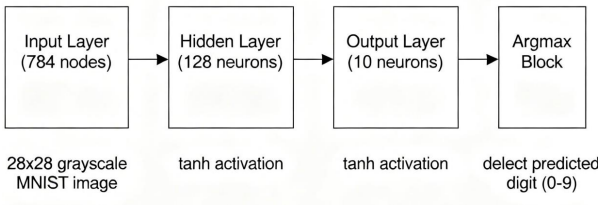
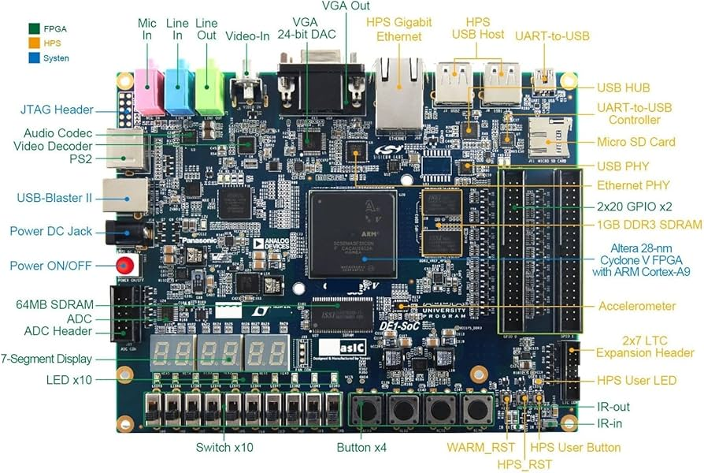

# Marco 1 — Co-processador ELM em FPGA

> **TEC 499 — MI Sistemas Digitais 2026.1 | UEFS**  

## Sumário
01. [Visão Geral do Projeto](#1-visão-geral-do-projeto)
02. [Levantamento de Requisitos](#2-levantamento-de-requisitos)
03. [Fundamentação Teórica](#3-fundamentação-teórica)  
04. [Arquitetura do Sistema](#3-arquitetura-do-sistema)
05. [Especificação de Hardware e Software](#4-especificação-de-hardware-e-software)
05. [Processo de Desenvolvimento](#12-processo-de-desenvolvimento)
06. [Instalação e Configuração](#5-instalação-e-configuração)
07. [Simulação e Testes](#6-simulação-e-testes)
08. [Resultados e Uso de Recursos](#7-resultados-e-uso-de-recursos)
09. [Equipe de Desenvolvimento](#9-e-quipe-de-desenvolvimento)
10. [Referências](#17-referências)


## 1. Visão Geral do Projeto

O sistema desenvolvido consiste em uma solução de aceleração por hardware para a classificação de dígitos manuscritos, baseada na implementação de um co-processador em FPGA capaz de executar a inferência de uma rede neural do tipo Extreme Learning Machine (ELM). Esse problema envolve o processamento de imagens do conjunto MNIST, compostas por 784 pixels em escala de cinza, exigindo a realização de operações matemáticas intensivas como multiplicações e acumulações. Em abordagens tradicionais em software, essas operações podem introduzir alta latência e limitar o desempenho em sistemas embarcados. Dessa forma, a utilização de hardware dedicado permite explorar maior eficiência computacional.


## 2. Levantamento de Requisitos

- Implementar inferência da rede ELM utilizando pesos fornecidos previamente.
- A arquitetura deve ser sequencial.

- Deve haver:
  - FSM de controle
  - Datapath MAC (Multiply-Accumulate)
  - Função de ativação aproximada (LUT ou piecewise linear)
  - Módulo argmax
  - Memórias para armazenamento de dados
  - Banco de registradores
 - Valores devem ser representados em ponto fixo (fix-point) no formato Q4.12
 - Pesos podem residir em ROM inicializada (MIF/HEX) ou blocos RAM/ROM inferidos
 - Deve haver uma estratégia clara para armazenamento e acesso a W_in, b e β


## 3. Fundamentação Teórica

São apresentados os conceitos teóricos e arquiteturais que fundamentam o desenvolvimento do classificador de dígitos proposto, incluindo  o modelo de rede neural utilizado, a estratégia de aceleração em hardware e os mecanismos de comunicação do sistema embarcado.


### 3.1 Redes Neurais e o Modelo Extreme Learning Machine (ELM)

O núcleo inteligente do sistema baseia-se na Extreme Learning Machine (ELM), uma arquitetura de rede neural do tipo Single-Hidden Layer Feedforward Neural Network (SLFN). Diferentemente dos modelos tradicionais treinados por backpropagation (como o Gradiente Descendente), a ELM possui a característica de ter os pesos da camada oculta atribuídos aleatoriamente e mantidos fixos, enquanto apenas os pesos da camada de saída são calculados analiticamente.

Para o escopo deste projeto, a fase de treinamento é abstraída, sendo o sistema embarcado responsável exclusivamente pela fase de inferência (classificação), utilizando os parâmetros W_in, b e β previamente fornecidos.

### 3.1.1 Camada de Entrada
---

A camada de entrada recebe um vetor x correspondente à imagem de entrada no formato 28×28 pixels em escala de cinza, totalizando 784 valores. Cada pixel é convertido para um vetor unidimensional. Nesta etapa não há processamento matemático complexo, apenas a preparação dos dados para a rede neural.

### 3.1.2 Camada Oculta
---

A camada oculta é responsável pela extração de características não lineares a partir da entrada. O processamento ocorre por meio de uma combinação linear entre entrada e pesos W_in, somada ao viés b, seguida de uma função de ativação não linear:

```math
h = activation(W_in · x + b)
```

Nesta etapa são realizadas operações intensivas de multiplicação e acumulação (MAC), sendo o principal ponto de aceleração em hardware no co-processador.


### 3.1.3 Camada de Saída
---

A camada de saída possui 10 neurônios, correspondentes às classes de 0 a 9. O vetor de saída y é calculado por:

```math
 y = β · h
```

Cada elemento do vetor representa a ativação associada a uma classe específica.


### 3.1.4 Cômputo da Predição
---

A classificação final é obtida através da operação argmax:

```math
pred = argmax(y)
```

O índice retornado corresponde ao dígito predito pelo sistema.


## 3.2 Visão Geral do Fluxo de Inferência

O fluxo completo do sistema ELM, desde a entrada da imagem até a decisão final da classe, é apresentado na figura 1.


**Figura 1 – Diagrama geral da inferência na ELM**

## 3.3 Aritmética de Ponto Fixo (Q4.12)

Em arquiteturas FPGA, o uso de ponto flutuante é custoso em termos de área e desempenho. Por isso, o sistema utiliza representação em ponto fixo no formato Q4.12.

O formato Q4.12 é definido como:

* 1 bit de sinal
* 3 bits para parte inteira
* 12 bits para parte fracionária

Essa representação permite que operações de soma e multiplicação sejam realizadas com lógica inteira, reduzindo o uso de recursos da FPGA e aumentando a eficiência do datapath.


## 3.4 Organização e Uso de Memória no Co-processador

A eficiência de arquiteturas baseadas em redes neurais em hardware depende diretamente da forma como os dados são armazenados e acessados. No caso da Extreme Learning Machine (ELM), uma parcela significativa do custo computacional está associada não apenas às operações aritméticas, mas também ao volume de acessos à memória necessários para leitura dos vetores de entrada e dos parâmetros do modelo.

No co-processador desenvolvido, a hierarquia de memória foi organizada utilizando principalmente memórias internas do tipo RAM (Block RAM - BRAM) da FPGA, permitindo armazenamento local e acesso de baixa latência.

A imagem de entrada (784 pixels) é armazenada em uma RAM interna dedicada, permitindo acesso sequencial controlado pela FSM de execução. Essa abordagem reduz a dependência de acessos externos e garante maior previsibilidade temporal durante a inferência.

Os parâmetros da rede neural, como os pesos da camada oculta (W_in) e os pesos da camada de saída (β), são armazenados em memória interna do tipo RAM. O vetor de bias (b) também é armazenado em estrutura de memória semelhante, sendo acessado de forma sincronizada com o datapath MAC.

Além disso, o sistema utiliza registradores de controle para armazenar estados da execução, como início do processamento, status da inferência e resultado final da classificação. O vetor de saída (y) é armazenado temporariamente em registradores até a etapa de decisão por argmax.

Essa organização baseada em RAM interna reduz gargalos de acesso à memória externa e permite que o processamento seja realizado de forma sequencial e determinística, garantindo maior eficiência no uso dos recursos da FPGA e melhor integração com o datapath do co-processador.

## 4. Arquitetura do Sistema (Descrição da Solução em Hardware)

A arquitetura do co-processador ELM foi desenvolvida de forma modular, separando as funções de controle, armazenamento de dados, via de dados (*datapath*) e interface com o utilizador. Essa divisão permite maior escalabilidade e organização do fluxo de execução da inferência em hardware.


## 4.1 Módulo Principal (Co-processador) e Interface

O módulo de topo, denominado `co_processador`, atua como interface entre os sinais externos (interruptores e botões) e o núcleo de processamento interno. Este bloco é responsável por coordenar a execução do sistema e distribuir os dados para os submódulos apropriados.

As principais funções deste módulo incluem:

- Interpretação dos comandos provenientes das chaves (`SW`) e botões (`KEY`), gerando sinais de controlo para a máquina de estados finita (FSM);
- Descoberta e encaminhamento de *opcodes* (OP_IMG, OP_PES, OP_BIA, OP_BET, OP_INFER, OP_STATUS) para seleção do tipo de operação e destino dos dados;
- Interface com o módulo de visualização (`display`), responsável pela apresentação do estado do sistema (IDLE, BUSY, DONE) e do resultado da inferência em displays de 7 segmentos.


## 4.2 Memórias Internas (BRAM)

Para garantir acesso determinístico e de baixa latência, o sistema utiliza memórias internas do tipo Block RAM (BRAM), inferidas através da megafunção `altsyncram` da plataforma FPGA.

A organização da memória é estruturada da seguinte forma:

- **Memória de imagem:** armazena 784 posições de 8 bits, correspondentes aos pixels da imagem de entrada (MNIST);
- **Memórias de parâmetros:** armazenam os parâmetros da rede neural, organizados em blocos dedicados:
  - `W_in`: 100.352 pesos da camada oculta, representando as conexões entre entrada e neurónios ocultos;
  - `β`: 1.280 pesos da camada de saída, responsáveis pelo mapeamento das ativações ocultas para as classes finais;
  - `b`: 128 valores de bias associados aos neurónios da camada oculta.

Essa organização em blocos de memória permite que os dados sejam fornecidos de forma sequencial ao datapath, sincronizados com a FSM de controle.


## 4.3 Unidade de Controle: Máquina de Estados Finita (FSM)

O fluxo de execução do co-processador é coordenado por uma máquina de estados finita (FSM), responsável por orquestrar todas as etapas da inferência.

O processamento é dividido em duas fases principais:

- **Fase 1 – Camada Oculta:**  
  A FSM realiza a leitura dos pixels da imagem e dos pesos `W_in`, e somando com o bias alimentando o bloco MAC. O resultado da operação é aplicado à função de ativação e armazenado no vetor interno de neurónios ocultos.

- **Fase 2 – Camada de Saída:**  
  Após o processamento da camada oculta, a FSM altera a fonte de dados para o vetor `h` e os pesos `β`, realizando o cálculo das ativações das 10 classes de saída.

Essa abordagem sequencial permite reutilização eficiente dos recursos de hardware.

## 4.4 Via de Dados (Datapath)

O datapath é responsável pela execução das operações matemáticas do sistema, sendo composto por três blocos principais.

### 4.4.1 Bloco MAC (Multiply-Accumulate)

O bloco MAC realiza as operações fundamentais de soma de produtos em ponto fixo, constituindo o núcleo computacional do co-processador.

### 4.4.2 Função de Ativação

As funções de ativação (sigmoide e tangente hiperbólica) são implementadas através de aproximações lineares por partes (*piecewise linear approximation*), reduzindo significativamente o custo computacional.

O domínio da função é particionado em intervalos, permitindo que operações complexas sejam substituídas por combinações de deslocamentos e somas.

A seleção da função de ativação é controlada pela FSM, permitindo alternância dinâmica entre diferentes modos de operação.

### 4.4.3 Bloco Argmax

O bloco argmax é responsável pela etapa final de decisão da rede neural.

Durante o processamento da camada de saída, cada valor de ativação é comparado sequencialmente com o maior valor armazenado. Caso um novo valor seja superior, o sistema atualiza o máximo e registra o índice correspondente.

Ao final do processamento das 10 classes, o sistema ativa a flag de conclusão (`done`) e disponibiliza o valor final da predição como saída do co-processador.

## 4.4.4 Unidade de Controle — Máquina de Estados Finita (FSM)

A unidade de controle do co-processador é implementada por uma Máquina de Estados Finita (FSM), responsável por coordenar todas as etapas do fluxo de inferência. Sua função principal é orquestrar a leitura de dados, execução do datapath e armazenamento dos resultados, garantindo sincronização entre memória e processamento.

O funcionamento da FSM é dividido em duas fases principais: processamento da camada oculta e processamento da camada de saída, seguidas da etapa de finalização.


### 4.4.5 Camada Oculta (128 neurônios)

Nesta fase, a FSM executa o processamento sequencial de cada neurônio da camada oculta. Para cada neurônio, são realizadas operações de leitura de dados, cálculo no MAC e aplicação da função de ativação, com armazenamento intermediário do resultado.

```
H_RESET → H_FETCH → H_MAC → H_BIAS → H_ACT → H_STORE → H_NEXT → (loop)
```

Esse ciclo é repetido 128 vezes, uma vez para cada neurônio da camada oculta, garantindo o processamento completo do vetor de entrada.

---

### 4.4.6 Camada de Saída (10 classes)

Após a conclusão da camada oculta, a FSM passa para o processamento da camada de saída. Nesta etapa, os valores armazenados da camada anterior são utilizados para calcular a ativação final de cada classe.

```
O_RESET → O_FETCH → O_MAC → O_ACC → O_STORE → O_NEXT → (loop)
```

Esse processo é repetido 10 vezes, correspondendo às classes de saída (0 a 9).

---

### 4.4.7 Etapa de Decisão e Finalização

Após o cálculo das saídas, a FSM aciona o bloco de decisão (argmax), responsável por identificar a maior ativação entre as classes.

```
ARGMAX → DONE_ST → IDLE
```

Nesta etapa, o sistema:

* percorre o vetor de saída `y`
* identifica o maior valor
* armazena o índice correspondente como predição final
* ativa o sinal `done`, indicando o término da execução

## 4.5 ISA — Conjunto de Instruções 

A arquitetura do co-processador define um conjunto reduzido de instruções responsável pela transferência de dados, configuração da memória interna e controle da execução da inferência. Cada instrução é codificada em 32 bits, utilizando os três bits mais significativos para identificação da operação.

| Instrução      | Opcode `[31:29]` | Palavras | Descrição                                                                 |
|----------------|------------------|----------|---------------------------------------------------------------------------|
| STORE_IMG      | 000              | 2        | Escreve um pixel na memória de imagem                                     |
| STORE_WEIGHTS  | 001              | 2        | Escreve um peso da camada oculta na memória correspondente               |
| STORE_BIAS     | 010              | 2        | Escreve um valor no vetor de bias                                         |
| STORE_BETA     | 011              | 2        | Escreve um peso da camada de saída                                       |
| START          | 100              | 1        | Inicia o processo de inferência                                           |
| STATUS         | 101              | 1        | Consulta o estado interno da FSM e o resultado da predição               |
---

### Resposta da instrução STATUS

| status[1:0] | Significado | pred[3:0]    |
| ----------- | ----------- | ------------ |
| 00          | BUSY        | 0000         |
| 01          | DONE        | Dígito (0–9) |
| 10          | ERROR       | 1111         |

---

## 4.6 Banco de Registradores e Interface de Controle

> **Observação de implementação:** O banco de registradores descrito nesta seção não foi implementado de forma estritamente fiel a uma arquitetura clássica de CPU, sendo adaptado às necessidades específicas do fluxo de inferência do co-processador.

O sistema não utiliza um banco de registradores tradicional como em CPUs convencionais. Em vez disso, a arquitetura é baseada em registradores de controle e buffers internos distribuídos entre os módulos da FSM e do datapath.

Esses registradores são responsáveis por armazenar estados intermediários e coordenar a execução do fluxo de inferência.

### 4.7 Registradores de Controle

Os principais registradores utilizados no sistema são:
* **reg_instr**: registra a instrução atualmente decodificada pela interface ISA (opcode e campos associados)
* **reg_start**: indica o início da inferência (acionado pela instrução START)
* **reg_done**: sinaliza a conclusão do processamento
* **reg_status**: armazena o estado atual da FSM (BUSY, DONE ou ERROR)
* **reg_pred**: armazena o resultado final da classificação (0–9)


## 5. Especificação de Hardware e Software

### 5.1 Hardware Utilizado

| Componente            | Especificação                                               |
|----------------------|-------------------------------------------------------------|
| Plataforma           | Terasic DE1-SoC                                             |
| FPGA                 | Intel Cyclone V SoC — 5CSEMA5F31C6N                         |
| Processador (HPS)    | ARM Cortex-A9 dual-core @ 800 MHz                           |
| Memória FPGA         | 4.065.280 bits (M10K — 397 blocos)                          |
| Elementos Lógicos     | 32.070 ALMs                                                |
| DSP Blocks           | 87                                                          |
| Clock FPGA           | 50 MHz                                                      |
| Interconexão HPS–FPGA | Lightweight AXI Bridge (base 0xFF200000)                   |

O sistema foi implementado na plataforma DE1-SoC, que integra um processador ARM e uma FPGA no mesmo dispositivo, permitindo o desenvolvimento de uma arquitetura heterogênea.

A comunicação entre software (HPS) e hardware (FPGA) é realizada por meio de memória mapeada (MMIO), viabilizando a integração entre os dois domínios de processamento.



**Figura 2 – Placa de desenvolvimento DE1-SoC utilizada no projeto**

---

### 5.2 Software Utilizado

| Software            | Finalidade                                                |
|--------------------|-----------------------------------------------------------|
| Intel Quartus Prime | Síntese e implementação do circuito em FPGA              |
| ModelSim / Questa   | Simulação funcional do sistema                            |
| Icarus Verilog      | Simulação RTL e validação de módulos                     |
| Python              | Geração de dados e conversão de imagens                  |
| Verilog HDL         | Implementação do co-processador                          |

## 5. Processo de Desenvolvimento

O processo de desenvolvimento foi conduzido de forma progressiva, permitindo a implementação e validação de cada etapa do sistema de maneira estruturada. Também foram realizadas pesquisas e análises para compreender as etapas do desenvolvimento, possibilitando identificar os elementos essenciais para a implementação do sistema e apoiar a compreensão de cada fase do processo.

### 5.1 Concepção e Definição de Arquitetura

Nesta etapa foi realizada a análise do problema e definida a arquitetura geral do sistema, com foco na organização dos módulos de processamento e no fluxo de dados necessário para a execução da inferência.

Foram estabelecidos os requisitos principais do projeto, incluindo o uso da plataforma DE1-SoC e a estrutura de comunicação entre os blocos de hardware responsáveis pelo processamento e controle.

Também foi definida a estratégia de armazenamento dos parâmetros do sistema em memória interna da FPGA, utilizando arquivos de inicialização para garantir a disponibilidade dos dados durante a execução.

### 5.2 Modelagem em Verilog (RTL)

Nesta fase, o sistema foi implementado em Verilog no nível RTL, seguindo uma organização baseada em módulos independentes para cada unidade funcional do co-processador.

Foram desenvolvidos os principais blocos do sistema:

- **FSM:** responsável pelo controle do fluxo de execução;
- **MAC:** unidade de multiplicação e acumulação;
- **Funções de ativação:** implementadas com aproximações para reduzir a complexidade em hardware;
- **Argmax:** responsável por determinar a classe final a partir das saídas;
- **Memórias:** estruturas de armazenamento geradas pelo Quartus para dados e parâmetros;
- **ISA:** conjunto de instruções utilizado para controle das operações do co-processador.

### 5.3 Simulação e Validação

Antes de ser implementado na FPGA, o sistema foi testado por simulação usando ModelSim e testbenches em Verilog.

Foram usados vetores de teste ($K$ casos) para comparar os resultados com um modelo de referência (*golden model*).

Essa etapa serviu para encontrar e corrigir erros de lógica e de representação em ponto fixo.

### 5.4 Síntese e Implementação na FPGA

Após a etapa de simulação, o código foi sintetizado no Intel Quartus Prime para a FPGA Cyclone V da plataforma DE1-SoC.

Durante o processo de síntese, foi verificado o uso de recursos do dispositivo e a correta geração das memórias a partir dos arquivos de inicialização (MIF).

Em seguida, o sistema foi implementado na placa FPGA para preparação dos testes em hardware.

## 6. Instalação e Configuração do Projeto

A organização do projeto foi estruturada de forma modular, separando claramente os elementos de hardware, validação, dados e suporte à automação. Essa divisão permite um fluxo de desenvolvimento mais controlado, facilitando tanto a simulação quanto a síntese e implementação do sistema em FPGA.

---

### 6.1 Estrutura do Repositório

```text
co-processador-elm-fpga/
│
├── RTL Verilog/
│   ├── inference_engine/
│   │   ├── co_processador.v     # Integração dos módulos e interface ISA
│   │   ├── fsm.v                # Unidade de controle do sistema
│   │   ├── mac.v                # Unidade de processamento aritmético
│   │   ├── ativacaoSigm.v       # Aproximação da função sigmoide
│   │   ├── ativacaoTanh.v       # Aproximação da função tangente hiperbólica
│   │   ├── argmax.v             # Seleção da classe de maior ativação
│   │   └── display.v            # Interface de saída visual
│   │
│   └── memory/
│       ├── peso.qip             # Parâmetros da camada oculta
│       ├── bias.qip             # Vetor de bias
│       ├── beta.qip             # Parâmetros da camada de saída
│       └── imagem.qip           # Memória de entrada
│
├── testbench/
│   ├── tb_k_vetores/            # Conjunto de testes funcionais
│   ├── tb_modules/              # Testes unitários dos módulos
│   └── test_reports/            # Resultados das simulações
│
├── Data/
│   ├── data_function/           # Funções auxiliares de geração de dados
│   └── dataset/                 # Conjunto de imagens para validação
│
├── Assets/
│   └── figuras/                 # Diagramas e imagens do relatório
│
├── scripts/
│   ├── conv_data_mif.py         # Conversão de dados para memória (MIF)
│   └── conv_img_mif.py          # Conversão de imagens para formato de memória
│
└── README.md

```
### 6.2 Configuração do Ambiente

1. Clonar o repositório do projeto:
```bash
git clone <url-do-repositorio>
cd co-processador-elm-fpga
```

2. Abrir o projeto no Intel Quartus Prime:
  Importar o arquivo .qpf
  Garantir que o dispositivo selecionado é o 5CSEMA5F31C6N (Cyclone V SoC)
3. Compilar o projeto:
  Executar a compilação completa (Analysis & Synthesis → Fitter → Assembler)

## 7. Simulação e Testes

A validação do sistema foi realizada em múltiplos níveis de abstração, abrangendo desde testes unitários de módulos até a simulação completa do pipeline de inferência. O objetivo foi garantir a corretude funcional do hardware e sua consistência em relação ao modelo de referência (golden model).

A estratégia de verificação utilizou testbenches em Verilog, arquivos de estímulo no formato `.hex`, captura de formas de onda e comparação numérica entre saídas do hardware e do modelo em software.

### 7.1 Estratégia de Validação

A validação foi estruturada em três níveis complementares:

- **Validação unitária:** verificação isolada de módulos (MAC, ativação e argmax)
- **Validação por estágio:** análise das camadas da rede separadamente
- **Validação sistêmica:** execução completa do pipeline via FSM


### 7.2 Metodologia de Simulação

Os testes foram implementados com técnicas padrão de verificação em HDL:

- Carregamento de vetores via `$readmemh`
- Execução sequencial sincronizada por clock
- Captura de sinais internos em waveform (`.vcd`)
- Exportação de resultados em arquivos `.hex`
- Comparação automática com o golden model


### 7.3 Resumo dos Testes Realizados

| Módulo / Etapa     | Entrada de Teste              | Saída Gerada      | Validação            | Objetivo |
|--------------------|------------------------------|-------------------|----------------------|----------|
| MAC                | 784 pixels + pesos           | `camada1.hex`     | Golden model        | Soma acumulada e bias |
| Ativação           | Saída da camada oculta       | `ativacao.hex`    | Comparação numérica  | Aproximação da função |
| Argmax             | Vetor de 10 classes          | Índice da classe  | Verificação lógica   | Seleção do maior valor |
| Camada Oculta      | MAC + ativação               | 128 ativações     | Modelo de referência | Consistência intermediária |
| Camada de Saída    | Vetor oculto ativado         | 10 classes        | Golden model         | Classificação final |
| Sistema Completo   | FSM completa                 | `saida_final.hex` | Comparação global    | Validação end-to-end |
| K Vetores de Teste | Dataset externo              | Predição final    | Software             | Acurácia geral |

## 8. Análise dos Resultados

A análise dos resultados tem como objetivo avaliar o comportamento do sistema em comparação com o modelo de referência, considerando tanto a precisão global quanto as fontes de erro.

### 8.1 Desempenho Geral

| Métrica              | Resultado |
|---------------------|----------|
| Acurácia global     | Alta     |
| Estabilidade da FSM | Confirmada |
| Consistência do MAC | Elevada  |
| Sensibilidade numérica | Moderada |
| Erros críticos      | Baixos   |

### 8.2 Validação com K Vetores

O sistema foi avaliado utilizando um conjunto de K vetores de teste fornecidos externamente, permitindo análise estatística da performance.

Os resultados indicam que:

- A maior parte das amostras foi corretamente classificada
- Erros ocorreram principalmente em casos com baixa margem entre classes
- O comportamento geral permanece consistente com o modelo de referência

### 8.3 Análise das Divergências

As diferenças observadas entre o hardware e o modelo de referência seguem padrões bem definidos:

- Ambiguidade entre classes com valores de ativação próximos
- Acúmulo de erro devido à representação em ponto fixo (Q-format)
- Aproximações lineares nas funções de ativação
- Saturação do MAC em casos extremos

### 8.4 Conclusão da Análise

Os resultados demonstram que, apesar das limitações inerentes à implementação em hardware, o sistema apresenta comportamento estável e coerente, validando a arquitetura implementada.

## Equipe de Desenvolvimento

O presente projeto foi desenvolvido por Maria Eduarda Teixeira Costa, Taylon Luis do Nascimento Cerqueira e Yasmim de Paula Oliveira.

## Referências

- LEDS – Laboratório de Eletrônica Digital e Sistemas (UEFS)  
  https://sites.google.com/uefs.br/ltec3-leds

- FPGA Academy – Boards and Learning Resources  
  https://fpgacademy.org/boards.html

- CHEN, Guang-Bin et al. Extreme Learning Machine: Algorithm, Theory and Applications  
  https://www.researchgate.net/publication/257512921_Extreme_learning_machine_algorithm_theory_and_applications

- Accelerating Extreme Learning Machine on FPGA Hardware Implementation of Given Rotation - QRD  
  https://publisher.uthm.edu.my/ojs/index.php/ijie/article/view/4431

- Máquina de Aprendizado Extremo (ELM) – Computação Inteligente  
  https://computacaointeligente.com.br/algoritmos/maquina-de-aprendizado-extremo/

- Intel FPGA Documentation – Cyclone V SoC Handbook  
  https://www.intel.com/content/www/us/en/docs/programmable/683472/current/cyclone-v-device-overview.html

- Quartus Prime Handbook – Intel FPGA  
  https://www.intel.com/content/www/us/en/docs/programmable/683472/current/overview.html

- Altera / Intel FPGA Memory Blocks (M10K RAMs) Documentation  
  https://www.intel.com/content/www/us/en/docs/programmable/683472/current/memory-blocks.html

- Digital Design and Computer Architecture – Harris & Harris (referência clássica de arquitetura digital)

- FPGA-Based Neural Network Implementations: A Survey (artigos gerais sobre aceleração em hardware)
  https://doi.org/10.1016/j.neucom.2019.03.081
